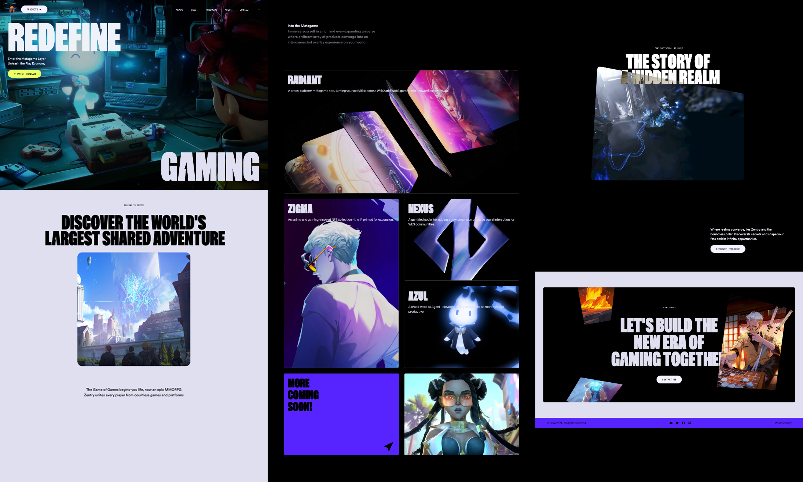

<div align="center">

# 🚀 Awwwards Winning Website — Immersive Animated Web Experience

A sleek and modern UI/UX experience built with React, GSAP, and TailwindCSS — featuring dynamic visuals, parallax effects, and responsive design.

</div>

---

<div align="center">

### 🛠 Built With

[](https://reactjs.org/)
[](https://vitejs.dev/)
[](https://tailwindcss.com/)
[](https://greensock.com/gsap/)
[](https://developer.mozilla.org/en-US/docs/Web/JavaScript)

</div>

---

## 🧠 Overview

**Awwwards Winning Website** is a fully responsive and animated **UI/UX showcase site**.  
It features immersive sections like a hero banner, animated features, interactive story highlights, and a smooth-scroll experience — all crafted with a clean and scalable component structure.

Inspired by [JavaScript Mastery](https://www.youtube.com/@javascriptmastery), this project is ideal for **designers, front-end developers, and creative coders** who want to **explore animation-rich interfaces and build pixel-perfect web experiences**.

---

## 📸 Demo



---

## 🌐 Live Demo

[](https://awwwards-winning-website-seven.vercel.app/)

---

## 🔍 Highlights

- ✅ Responsive design
- ✅ Smooth animations and transitions
- ✅ Reusable UI components
- ✅ Content-managed sections
- ✅ Scalable, modular codebase
- ✅ Beautiful visuals and interactive elements

---

## ✨ Features

- 🎯 Animated Hero Section with layered GSAP transitions
- 🧩 Dynamic Parallax Effects enhancing scroll interactions
- 📝 Structured sections for Story, About, and Contact
- 📱 Fully Responsive Design across all devices
- 🎨 Customizable components styled with TailwindCSS
- 🧠 Scroll-triggered animations and 3D hover effects

---

## 📦 Project Structure

```bash
📁 src/
├── components/        # Individual UI components (Hero, Navbar, Button, etc.)
├── assets/            # Static assets like images and videos
├── App.jsx            # Main app layout integrating all sections
├── main.jsx           # Entry point for React and Vite
└── index.css          # Global styles and Tailwind imports
```

---

## 🛠️ Technologies Used

- **React** – Frontend framework
- **Vite** – Fast build tool
- **TailwindCSS** – Styling framework
- **GSAP** – For animations and smooth scrolling effects
- **React Icons** – For including vector icons

---

## 📦 Installation & Setup

1. **Clone the repository:**

   ```sh
   git clone https://github.com/Oran01/Awwwards-Winning-Website.git
   cd Awwwards-Winning-Website
   ```

2. **Install dependencies:**

   ```sh
   npm install
   ```

3. **Start the development server:**

   ```sh
   npm run dev
   ```

4. Open [http://localhost:5173](http://localhost:5173) in your browser.

---

## 📺 Based on JavaScript Mastery

This project was built by following the tutorial from [JavaScript Mastery](https://www.youtube.com/watch?v=zA9r5zTllx4&t=29s).

---

## ⚠️ Disclaimer

All design credits go to [Zentry](https://zentry.com/). This project is created purely for educational purposes and is not intended for commercial use or public deployment.

---

## 🤝 Contributing

Feel free to fork this repository and submit pull requests to improve the project!

⭐ If you enjoyed this project, please consider giving it a star!
